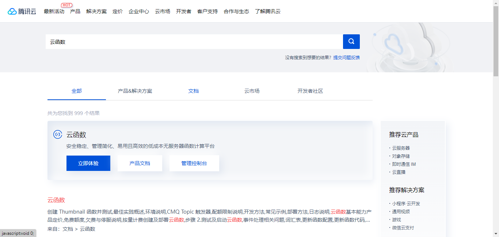

# 给女朋友的天气推送 --云函数版

安装依赖
-------

```js
npm install
```

## 安装

```tex
更改cfg对象的配置


微信公众号推送模板，可以根据自己需求修改
{{morning.DATA}} 
{{dateAndWeek.DATA}} 
城市：{{city.DATA}} 
天气：{{weather.DATA}} 
最低气温：{{lowest.DATA}} 
最高气温：{{highest.DATA}} 
降雨概率：{{pop.DATA}} 
今日建议：{{tips.DATA}} 
今天是我们恋爱的第{{loveDay.DATA}}天 
距离我的生日还有{{myBirthday.DATA}}天 
距离崽崽生日还有{{babyBirthday.DATA}}天 

彩虹屁： {{pipi.DATA}}
```

## 部署到云函数

### 华为云

---------
1.搜索云函数

2.点击创建云函数

3.输入云函数名称，选择Node.js，点击创建函数

4.点击长传自，选择zip文件，将index.js、node_modules、package.json、package-lock.json一起打包成zip文件，点击上传


5.点击测试，查看是否正常推送

6.点击设置，设置云函数的触发器，选择触发器为定时触发

这里我推荐使用Cron表达式，可以在华为云自行查看

```js
0 15 2 * * ?   每天凌晨2点15分执行
0 0 7 * * ?    每天早上7点执行
```

---------

### 腾讯云

---------
1.搜索云函数，点击立即体验，点击前往控制台


2.点击创建云函数，运行环境选择Node.js，点击上传本地zip包，并点击完成


3.注意修改index.js的最下面的exports，将287行注释掉，将289行取消注释

4.点击测试，查看是否正常推送

5.选择触发管理，设置云函数的触发器，选择触发器为定时触发，使用固定时长或者Cron表达式


# 作者

<i>林轻影</i><br>
<a href="https://github.com/linqingying123/tianqituisong">github</a>

